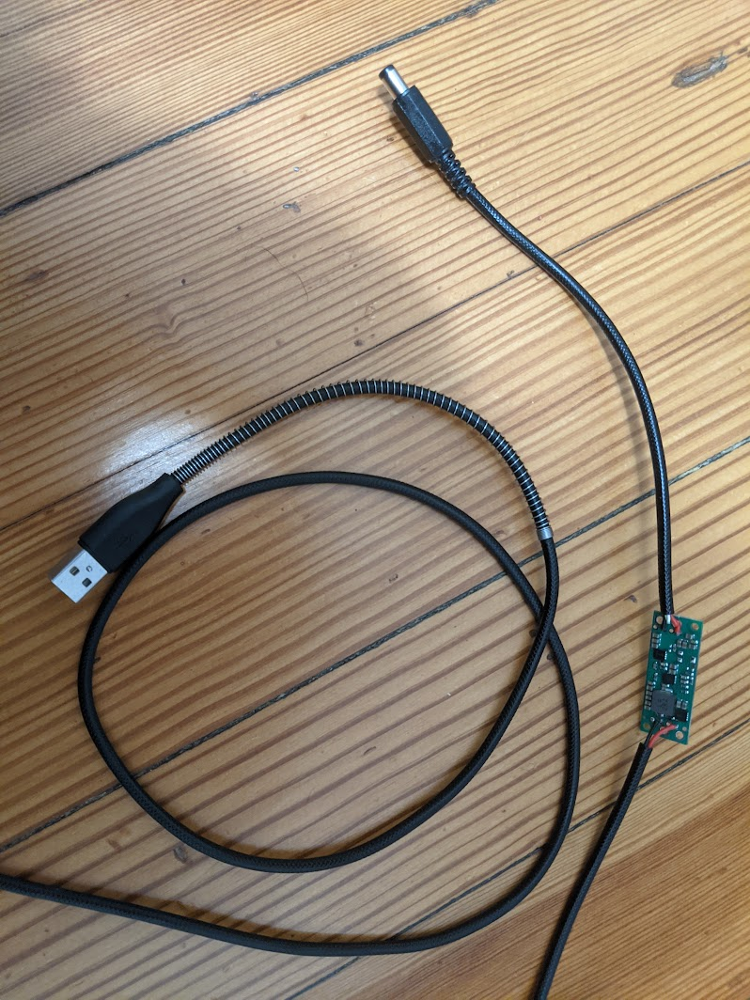

# HDM Z2 Auto

I like to hike and camp, but have sleep apnea. Since I find I'm much better if I get a full night's sleep, I purchased a system that I could travel with and use a standard phone power bank to run. I'm fortunate in that my settings are only about 5mmHg, so I don't use that much power.

My machine is an [HDM Z2 Auto](https://breas.us/products/cpaps-for-travel/z2-auto/),
I've made two power cables for it. I've used multiple power banks with it:
1. A 97Wh (20,000mAh) battery pack (omni20+) is about 40% used after an 7.5hr night
1. A 114Wh (30,000mAh) Baseus battery pack](https://www.amazon.com/gp/product/B08JV4W4NY), it uses about 25% per night (7.5hrs) with my settings
1. A 297Wh (80000mAh) EnginStar Portable Power Station https://www.amazon.com/gp/product/B07WQN41V9 with a [65w car USB-C adapter](https://www.amazon.com/gp/product/B08QZ7RTSW)

My favorite is the omnicharge 20+, but that is big for backpacking, the other  "cheapo generic" with more actual capacity that I use. A catch is that it can't run cpap and charge phone at the same time due to how it regulates power.

The EnginStar and the OmniCharge can both hook up to a solar cell for recharging. The Omnicharge can't provide USB-C power while charging via solar (it can provide USB-A)

## What is in My kit?

1. HDM Z2 Auto
1. Power Cable, one of:
   1. USB-C 15v Trigger Cable (see below)
   1. USB-C 12v Trigger Cable with 15v Regulator (see below)
   1. USB-A with 15v Regulator (see below)
1. HDM Z2 muffler
1. HDM Z2 Hose Connector
1. One P30i head mask and medium nasal pillow
1. Flexible Hose
1. Humidity Exchanger
1. [Baseus 45w 114wh Power Bank](https://www.amazon.com/gp/product/B08JV4W4NY)

### Picture of My Kit, 9v Battery for Scale

## Trigger Cable Option (Easiest)

A USB-C Trigger table connects and produces a fixed, preset voltage if the USB-C charger can supply the requested voltage. This is the easiest way to run an HDM Z2 from a phone power pack.

If you use a USB trigger cable make *_SURE_* you get a 15v part and check the specs on your power bank. I tested with a multimeter, and a PD power brick good for 45+w which support 15v output (most that do 20v will do 15v).  That isn't a big deal to me. As with everything, you're not using your CPAP with the expected cables/power, so caveat emptor; be careful, check your final power and polarity many times.

## 12v USB-C Cable with 15V Voltage Regulator (More Powerbank Choices)

(2020) Many phones/power banks only provide power for quick charging phones like pixels/iphones which charge at 18w requesting 12v @ 1.5amps from the USB-C source. These power banks and chargers do not supply the 15v required for the above cable. By adding a [voltage regulator](https://www.pololu.com/product/2896), you can use a 12v trigger cable and still supply 15v to the device. 18w should supply enough power to run the Z2 at nearly all pressures.

Note: I've found at least one power brick which supports 18w/12v PD and quickcharges my phone, but seems to have trouble with the sudden power surge to start the motor.

### Parts

To build, get the following:
1. 12v Trigger cable to 5.5 x 2.1mm barrell connector](https://www.amazon.com/gp/product/B08NTVLZH7)
1. 15v Polulu voltage regulator](https://www.pololu.com/product/2896)

### Building
1. Cut the cable about midway through, strip the wires on both sides
1. Tin the tips of the wires
1. Solder the wires into the voltage regulator.
   1. Red on USB-C side to VIN, black to GND
   1. Red on barrel connector to VOUT, black to GND
1. Make a box, or otherwise secure the voltage regulator
1. Plug into a power bank and test with a multimeter, ensure that the device is 15v, center positive

Note: the HDM Z2 will power up with a 12v supply, it will not be able to run the motor, and should power back down. If you have the HDM battery pack, that charges from 12v, which is why you can find 12v car plugs for the HDM Z2, but they're unable to run the device. You can use the same technique here on the car cable to run your Z2 from a car adaptor. Being that I charge my phone from my car, I don't see the point of making a second cable.

## USB-A Cable with Voltage Regulator (Most Powerbank Choices)

An alternative path, which requires some soldering, is to sacrifice a USB cable, and connect the 5v (red) and Ground (black) cable to the input side of a  [Polulu 15v regulator](https://www.pololu.com/product/2896). Connect the output side to a [5.5mm x 2.1mm barrel connector](https://www.amazon.com/gp/product/B083J24LTZ). Make sure the 15v is connected to the center, and the ground to the outside. Validate that it is center positive and is 15v with a multimeter.

I started building this because my USB-C cable didn't sit as tight as a USB-A cable does, and I wanted to have some choices for power banks.

The advantage of this cable is that nearly any USB power bank will work, depending upon your settings. With my settings, the draw is about 0.9-1.2amps (4-6w), but spikes to a touch over 2.5amps when starting up. Many power banks provide up to 2.4amps (12w), and some support quite a bit more (e.g. my Baseus will provide over 3amps, as did an old Anker that I tried).

If your power bank can't handle the device, you'll usually find out as soon as you start breathing, the Z2 will power off when it can't draw enough power.

Note: the cable is not Quick-Charge compatible, some QC ports won't give you more than an amp (5w) without talking quickcharge.

### Picture of the finished cable.

