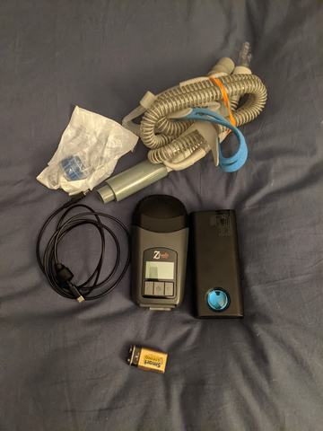

# HDM Z2 Auto

I like to hike and camp, but have sleep apnea. Since I find I'm much better if I get a full night's sleep, I purchased a system that I could travel with and use a standard phone power bank to run. I'm fortunate in that my settings are only about 5cmH2O, so I don't use that much power.

My machine is an [HDM Z2 Auto](https://breas.us/products/cpaps-for-travel/z2-auto/),
I've made three power cables for it. I've used multiple power banks with it:
1. A 114Wh (30,000mAh) [Baseus battery pack](https://www.amazon.com/gp/product/B08JV4W4NY), it uses about 25% per night (7.5hrs) with my settings
1. A 71Wh (20,000mAh) [Omnicharge Omni20](https://www.omnicharge.co/products/omni-20/)) is about 40% used after an 7.5hr night. Works well with solar panels.
1. A 92Wh (25,600mAh) [Omnicharge OmniMobile](https://www.amazon.com/gp/product/B07SR337PP) This provides more power than the omni20 but you lose the inverter and power display. Like with the Omni20, it works very well with solar panels, and is one of my go-to's for backpacking.
1. A 297Wh (80000mAh) [EnginStar Portable Power Station](https://www.amazon.com/gp/product/B07WQN41V9) with a [65w car USB-C adapter](https://www.amazon.com/gp/product/B08QZ7RTSW) This is big and heavy.
1. A (26800mAh) [Anker Astro E7](https://www.anker.com/ca/products/variant/astro-e7-26800mah-portable-charger/A1210012) This needs a handmade USB-A power cable and voltage regulator.
1. A (266wH) [Renogy 266whH Battery](https://www.amazon.com/gp/product/B0791WDZTW) Heavy, about 2x the size of the Omnicharge and maybe 3-4x the mass. This works well with 20+v solar panels, lower power ones not as well. Also great for several nights without charging (I've not measured, but I'd not be surprised if i could get between 4 and 6).

My favorite is the [Omnicharge](https://www.omnicharge.co/products/omni-20/), but that is big for backpacking. My most used is the [Baseus](https://www.amazon.com/gp/product/B08JV4W4NY) which has more capacity for similar weight than the Omni20 and is smaller. It gives me two nights with between 20-33% capacity remaining depending upon conditions. A catch is that it can't run CPAP and charge a phone at the same time unless both request the same voltage due to how the device regulates power. I used the [Renogy](https://www.amazon.com/gp/product/B0791WDZTW)  for an 9 day canoeing trip away from power (call out to [Maine High Adventure](https://www.mainehighadventure.org/)). Its heavy but works and can manage 20+v solar panels. I also use an [OmniMobile](https://www.amazon.com/gp/product/B07SR337PP) which has nearly as much power as the Baseus for similar weight, but also can handle a solar panel's raw input.

The EnginStar, Renogy, and OmniCharge batteries can hook up to a solar cell for recharging. The Omnicharge can't provide USB-C power while charging via solar (it can provide USB-A). The Enginstar's built-in USB-C adaptor doesn't emit enough power, so I use a [12v car USB-C plug](https://www.amazon.com/gp/product/B08QZ7RTSW). Both the Enginstar and the Omnicharge can handle 12v, 18v, and 20v panels, the Renogy can only handle 18v and 20v panels.

For solar, I have the following panels:
* [18v SunPower 50 Watt Flexible Monocrystalline panel](https://www.amazon.com/gp/product/B07C34GHGV) waterproof and rugged as well, but not very flexible. One survived multiple mishaps canoing in rapids, including being immersed with full force of a river on it for about 30m. This didn't come with a cable usable for my powerbanks, I used [this one](https://www.amazon.com/gp/product/B09HT2DX2G) 
* [12v 50w rugged flexible/rollable panel](https://www.amazon.com/gp/product/B09154L69K) also waterproof and fairly rugged, but no longer made which is frustrating. Not all batteries like 12v. Note: this came with an adapter to standard barrel jack, but had incorrect polarity on the plug, so it didn't work until I fixed it. 
* [100w 18v foldable fair weather cell](https://www.amazon.com/gp/product/B075YRKVMH) I use with my laptop. It is big and heavy and claims water resistant, but I'm not so sure. In decent sun at my latitude (43+ degrees north), It will max out the inputs of my omnicharge (about 40-45w), likely it is able to produce more.
* [20w 18v FlexSolar Foldable](https://www.amazon.com/gp/product/B09H6HN658) This is not waterproof, but resistant probably can handle rain, the power plugs appear to not be water proof, but the cells do. I usually see about 12-14w from it at my latitude (43+ degrees north). This is an ok weight for my backpack
* [40w 18v FlexSolar Foldable](https://www.amazon.com/gp/product/B09H6GGK55) Like the 20w, this is not waterproof, but resistant probably can handle rain, the power plugs appear to not be water proof, but the cells do. I usually see about 26-30w from it at my latitude (43+ degrees north). This is a bit heavy for a backpack, but I'm happy to put it in a bike carrier or similar.

## What is in my backpacking kit?

1. [HDM Z2 Auto](https://breas.us/products/cpaps-for-travel/z2-auto/)
1. Power Cable, one of:
   1. [USB-C 15v Trigger Cable](https://www.amazon.com/gp/product/B08NTTK8S9) (see below) I use this the most, it most reliably provides full power to the motor
1. [HDM Z2 muffler](https://www.cpapxchange.com/q-lite-in-line-cpap-bipap-muffler-kit.html) (came with machine)
1. [HDM Z2 Hose Connector](https://www.amazon.com/Replacement-Custom-Adapter-Design-Medical/dp/B07G4HKHX1) (came with machine)
1. One P30i head mask and medium nasal pillow; all is an extra from my Airsense; parts below:
   1. [Medium Nasal Pillow](https://www.amazon.com/gp/product/B07R6B17QS)
   1. [Swivel Elbow Connector](https://www.amazon.com/gp/product/B08H564YLP)
   1. [Headstrap](https://www.amazon.com/gp/product/B07P5HPCLR)
   1. [Airfit Std System](https://www.amazon.com/gp/product/B07P5FYYL3)
1. [Flexible CPAP Hose](https://www.amazon.com/Premium-Universal-CPAP-Tubing-Hose/dp/B01N4RGZ80)
1. [Humidity Exchanger](https://www.amazon.com/gp/product/B07PMNMTTC)
1. [Baseus 45w 114wh Power Bank](https://www.amazon.com/gp/product/B08JV4W4NY) OR [Omnicharge OmniMobile](https://www.amazon.com/gp/product/B07SR337PP)

All of the above fit into a standard one gallon ziptop freezer bag, which I can put into my backpack.

I've been meaning to replace my hose with a smaller [collapsible hose](https://www.amazon.com/INNOTECH-4332594073-TravelHose-Collapsible-CPAP/dp/B01B5DHJ5O), but haven't tried it yet.

### Picture of My Kit, 9v Battery for Scale

### Picture of Maine High Adventure Kit
1. CPAP, cables, hoses (in orange 2L drybag)
1. [Omnicharge Omni20+](https://www.omnicharge.co/products/omni-20/)
1. [Renogy 266whH Battery](https://www.amazon.com/gp/product/B0791WDZTW) Heavy, about 2x the size of the Omnicharge.
1. [Sunpower 50w solar cell](https://www.amazon.com/gp/product/B07C34GHGV)
1. Solar power cables and watt meter

I took this equipment with me on a 9 day white and flat water canoe trip with scouts. Kudos on the solar cell and the gear. I dumped my canoe far too many times on rocks, including pinning it with the river flowing right into my gear failing nearly of my water protection (dry bags in side of dry bags inside of a sealed plastic bag got at least damp if not wet). Kudos for the Renogy for living up to its splash proof rating (the omni charge managed to NOT get more than lightly damp). My cpap survived, but, I field stripped and dried it out before energizing it. Only real problem was wet USB cables.

Bigger kudos to the sunpower cell. It was beat up *hard*, lots of scratches, flexing, bumping, banging, etc. I think voltage is down 1-2v, but it is still producing power, just less, note that this cell was damaged before I started and only provided about 2/3 of max rated (a new cell yields 43w on my omnicharge).  My omnicharge is still able to draw 26w from it in good conditions, the renogy about 17w (the renogy is not very good when voltages drop below 18v). The renogy used to be able to get about 23-25w, but I believe the gap is due to the cell producing less voltage from all of the scatches.

## Camping?

I often camp and/or backpack with my family and with scouts (I assist my son's Scoutmaster). In warmer weather, I use a [Warbonnet Blackbird XLC hammock](https://www.warbonnetoutdoors.com/product/blackbird-xlc/), and run hoses over the ridgeline and store the machine in the "shelf", it ends up being more comfortable than my bed at home. In colder weather, I use a tent and things work roughly like at home save that I'm using a different machine. If it is really cold, the humidity exchanger can freeze up, I try to remember to put the Z2 into my sleeping bag so that it draws warmer air. A challenge for backpacking is that I'm starting with about 1.5-2lbs more weight and a gallon of volume filled in my pack.

# Power Cable for running the HDM Z2 Auto from a USB-C powerbank

## 15V Trigger Cable

| :warning: WARNING: making mistakes, wrong, or faulty parts could damage your CPAP machine! |
| --- |

A USB-C Trigger table connects and produces a fixed, preset voltage if the USB-C charger can supply the requested voltage. This is the easiest way to run an HDM Z2 from a phone power pack, and what I use most often. I've also found that with my power banks, this cable tends to provide the most power the most quickly, so my CPAP has a touch more airflow using this cable than the other options (this may be in my head, so...).

If you use a USB trigger cable make *_SURE_* you get a 15v part and check the specs on your power bank. I tested with a multimeter, and a PD power brick good for 45+w which supports 15v output (most that do 20v will do 15v).  That isn't a big deal to me. As with everything, you're not using your CPAP with the expected cables/power, so caveat emptor; be careful, check your final power and polarity many times.

I first made my own cable, then bought [this one](https://www.amazon.com/gp/product/B08NTTK8S9) If you buy the premade, make _SURE_ to test it with a multimeter in case you accidentally received the wrong part.

## Other options

I've also looked into other power cables, including USB-A with a voltage regulator. I'm separating those into a different page as they require soldering and the USB-C trigger cable seems to work the best.

[All cable options that I've tested, separating to avoid confusing people](alternate_cables.md)

