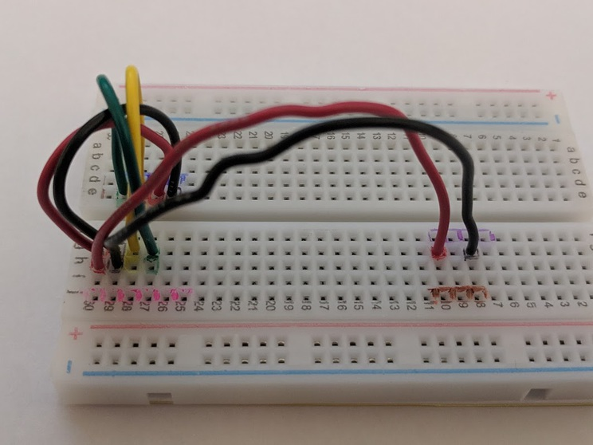

# Assembly Instructions

## Parts List

1. Short Green Wire
1. Short Yellow Wire
1. Short Black Wire
1. Short Red Wire
1. Long Black Wire
1. Long Red Wire
1. BME280 Sensor, purple colored
1. SD1660 LCD Display
1. Arduino Nano (with Green and Yellow Wires sticking out)
1. Breadboard

## Assembly

### Connect wires between sensor and display

- [ ] Place short red wire in pin g-30 and e-27
- [ ] Place short black wire in pin g-29 and e-26
- [ ] Place short yellow wire in pin g-28 and e-28
- [ ] Place short green wire in pin g-27 and e-29

### Connect wires between sensor and arduino
- [ ] Place long red wire in pin h-30 and g-10
- [ ] Place long black wire in pin h-29 and g-8

### Install Arduino
It should have four pins connecting between f-10 and f-7 (purple line)

- [ ] Connect arduino yellow wire to pin h-28
- [ ] Connect arduino green wire to pin h-27

### Install Sensor (BME280)

- [ ] Place the sensor in row j, pins 25-30, with "VCC" in pin 30. (should be along pink line).
- [ ] SDA should line up with green wire, SCL with yellow wire, VCC with red, GND with black

### Install Display

- [ ] Place the display in row d pins 26-29.
- [ ] SDA should line up with green wire, SCL with yellow wire, VCC with red, GND with black

### Connect power terminal to battery pack wires

With the legs facing up, the black wire is on the left, red wire on the right

### Connect power terminal to breadboard

The red leg should be in pin j-10 and the black in j-8

### Turn on power

## Debugging

If after a few seconds the display doesn't turn on, check that all of the wires
are well seated (not metal sticking out) and try wiggling them a little.
