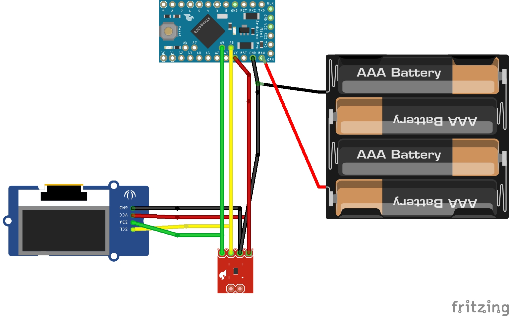
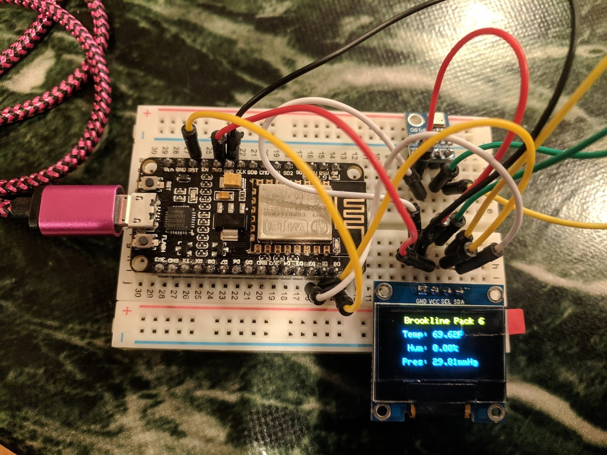
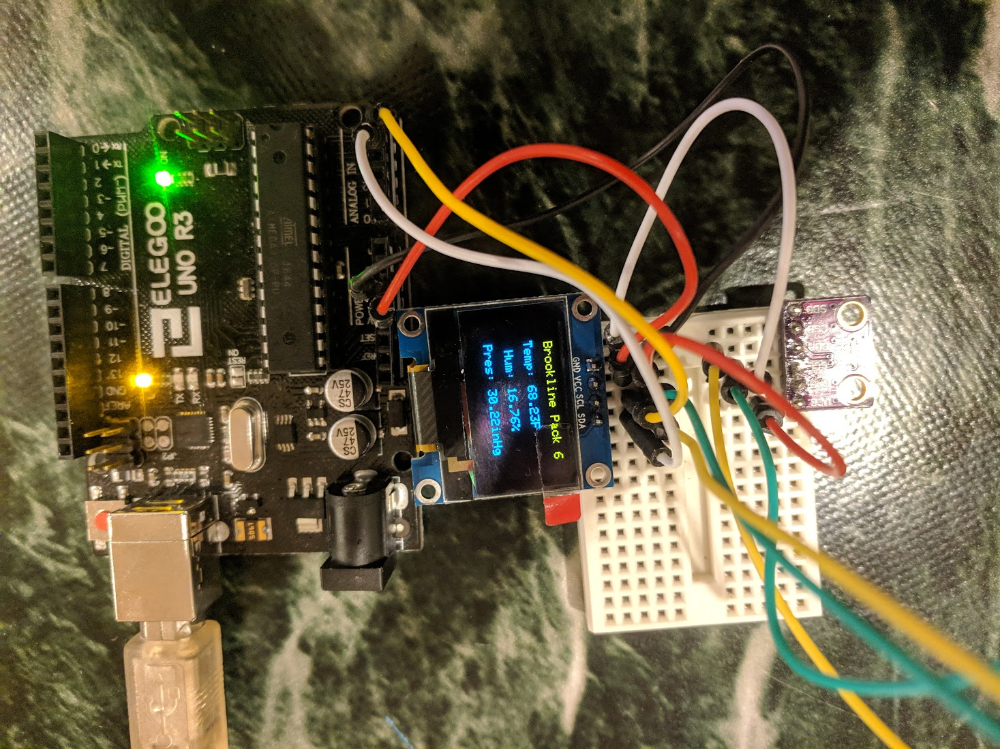

# Brookline Pack 6 Webelos Weather Station 

This implements a simple weather station using temperature/humidity/pressure
sensors such as BME280, BME180, or DHT22. Note: the latter two omit one of the three
sensor options.

For a display, either an LCD LED or an SSD1306 OLED are supported.

This has been tested on both an ESP8266 and an Arduino board.

## Circuit 

### ESP8266 

Connect I2C devices:
* SCL to D1
* SDA to D2
* 3V  to VCC
* GND to GND

For deep sleep, you will need
to connect a cable from RST to D0. You'll want
to use something you can disconnect, as this must
be disconnected when programming the device.

Note: DHT sensor not tested on this device.

### Arduino

Connect I2C devices:
* SCL to A5
* SDA to D4
* 3V  to VCC
* GND to GND

Note: If using DHT22 sensor, connect it to pin 4

## Modify the Code 

Edit the code, look for "set what you're using here"
and set the appropriate definitions.

## Configuring the Arduino IDE 

### ESP8266 Board 
Follow the directions here:
https://github.com/esp8266/Arduino

### Libraries

Install:
#### Adafruit Unified Sensor 
author=Adafruit <info@adafruit.com>
maintainer=Adafruit <info@adafruit.com>
sentence=Required for all Adafruit Unified Sensor based libraries.
url=https://github.com/adafruit/Adafruit_Sensor

#### Adafruit_BMP085_Unified
name=Adafruit BMP085 Unified
author=Adafruit
maintainer=Adafruit <info@adafruit.com>
sentence=Unified sensor driver for Adafruit's BMP085 & BMP180 breakouts
url=https://github.com/adafruit/Adafruit_BMP085_Unified

#### Adafruit_BME280_Library
author=Adafruit
maintainer=Adafruit <info@adafruit.com>
sentence=Arduino library for BME280 sensors.
url=https://github.com/adafruit/Adafruit_BME280_Library

#### Adafruit_GFX_Library 
author=Adafruit
maintainer=Adafruit <info@adafruit.com>
sentence=Adafruit GFX graphics core library, this is the 'core' class that all our other graphics libraries derive from.
url=https://github.com/adafruit/Adafruit-GFX-Library

#### Adafruit_SSD1306
author=Adafruit
maintainer=Adafruit <info@adafruit.com>
sentence=SSD1306 oled driver library for monochrome 128x64 and 128x32 displays
url=https://github.com/adafruit/Adafruit_SSD1306

#### LiquidCrystal_I2C
author=Frank de Brabander
maintainer=Marco Schwartz <marcolivier.schwartz@gmail.com>
sentence=A library for I2C LCD displays.
category=Display
url=https://github.com/marcoschwartz/LiquidCrystal_I2C

#### DHT_sensor_library
author=Adafruit
maintainer=Adafruit <info@adafruit.com>
sentence=Arduino library for DHT11, DHT22, etc Temp & Humidity Sensors
url=https://github.com/adafruit/DHT-sensor-library

# Photos
## ESP8266/NodeMCU

## Arduino

