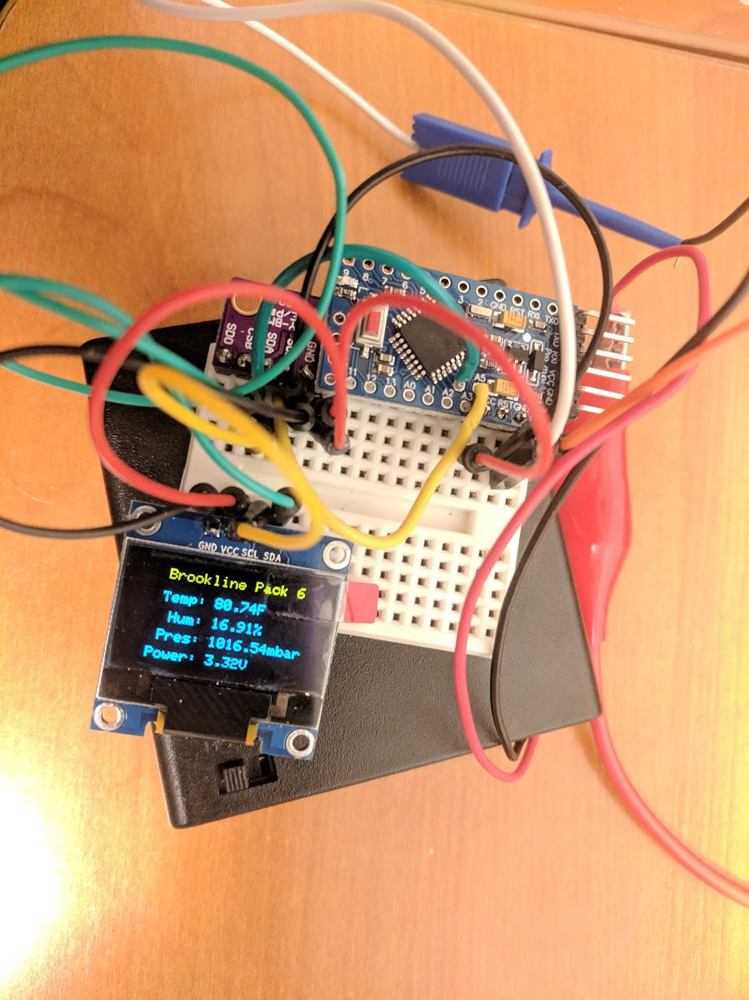

# Brookline Pack 6 Webelos Weather Station

This implements a simple weather station using temperature/humidity/pressure
sensors such as BME280, BME180, or DHT22. Note: the latter two omit one of the three
sensor options.

For a display, either an LCD LED or an SSD1306 OLED are supported.

This has been tested on ESP8266 Arduino UNO, Arduino Pro-Mini, and a raw ATMega328p using on board clock (programmed via USBasb).

## Circuit


## Programmer I used for the pro-minis
https://www.amazon.com/gp/product/B00QT7LQ88

It is missing the reset pin, plug the 5V/GND/TX/RX pins in, when programming
hold the reset button until the Arduino IDE starts uploading, then release the reset button.

Wires for this controller:
  Red: 5V/VCC
  Black: GND
  White: RX
  Green: TX

This one is probably better:
https://www.amazon.com/gp/product/B014GZTCC6

both use this driver:
https://www.ftdichip.com/Drivers/VCP.htm

Of note, controller pins:
* 1 - Black:GND
* 2 - Blue:CTS
* 3 - Red:5V
* 4 - Green:TXD
* 5 - White:RXD
* 6 - Yellow:RTS


### ESP8266

Connect I2C devices:
* SCL to D1
* SDA to D2
* 3V  to VCC
* GND to GND

For deep sleep, you will need
to connect a cable from RST to D0. You'll want
to use something you can disconnect, as this must
be disconnected when programming the device.

Note: DHT sensor not tested on this device.

### Arduino

Connect I2C devices:
* SCL to A5 (yellow wire in final picture)
* SDA to A4 (green wire in final picture)
* 3V  to VCC (red wire in final picture)
* GND to GND (black wire in final picture)

Note: If using DHT22 sensor, connect it to pin 4

#### Arduino Pro-Mini 3.3v
These work great, and are what the final boards will be.

While running the circuit, they draw 3.5ma with the power LED while sleeping, 2.1ma if you break it off. When awake, they go up to 5-6ma but are awake for a fraction of a second every 30s with the default sleep
settings.

Wire it as above, be aware that A4/A5 are offset pins right near the CPU, not along the edge.

#### Atmega328p
If you're willing to do it, it works great and is comparable to the pro-mini for power/etc.

This works fine. I used a USBasp device to program. Of note, on linux out of the box the arduino IDE didn't see the device/send the right commands, I just ran avrdude by hand after compiling,

e.g.

```
sudo /home/hagan/Downloads/arduino-1.8.9/hardware/tools/avr/bin/a
vrdude -C/home/hagan/Downloads/arduino-1.8.9/hardware/tools/avr/e
tc/avrdude.conf -v -patmega328p -cusbasp -Pusb -e -Ulock:w:0x3F:m -Uefuse:w:0x05
:m -Uhfuse:w:0xDA:m -Ulfuse:w:0xE2:m
```

Then:

```
sudo /home/hagan/Downloads/arduino-1.8.9/hardware/tools/avr/bin/a
vrdude -C/home/hagan/Downloads/arduino-1.8.9/hardware/tools/avr/e
tc/avrdude.conf -v -patmega328p -c usbasp -P usb -b57600 -D -Uflash:w:/tmp/ardui
no_build_506398/scout_weather_station.ino.hex:i
```

Note: you'll only need to use four pins:
* PIN20: AVCC
* PIN22: GND
* PIN27: SDA
* PIN28: SCL


## Modify the Code

Edit the code, look for "set what you're using here"
and set the appropriate definitions.


## Configuring the Arduino IDE

### ESP8266 Board
Follow the directions here:
https://github.com/esp8266/Arduino

### Libraries

Install:
#### Adafruit Unified Sensor
author=Adafruit <info@adafruit.com>
maintainer=Adafruit <info@adafruit.com>
sentence=Required for all Adafruit Unified Sensor based libraries.
url=https://github.com/adafruit/Adafruit_Sensor

#### Adafruit_BMP085_Unified
name=Adafruit BMP085 Unified
author=Adafruit
maintainer=Adafruit <info@adafruit.com>
sentence=Unified sensor driver for Adafruit's BMP085 & BMP180 breakouts
url=https://github.com/adafruit/Adafruit_BMP085_Unified

#### Adafruit_BME280_Library
author=Adafruit
maintainer=Adafruit <info@adafruit.com>
sentence=Arduino library for BME280 sensors.
url=https://github.com/adafruit/Adafruit_BME280_Library

#### Adafruit_GFX_Library
author=Adafruit
maintainer=Adafruit <info@adafruit.com>
sentence=Adafruit GFX graphics core library, this is the 'core' class that all our other graphics libraries derive from.
url=https://github.com/adafruit/Adafruit-GFX-Library

#### Adafruit_SSD1306
author=Adafruit
maintainer=Adafruit <info@adafruit.com>
sentence=SSD1306 oled driver library for monochrome 128x64 and 128x32 displays
url=https://github.com/adafruit/Adafruit_SSD1306

#### LiquidCrystal_I2C
author=Frank de Brabander
maintainer=Marco Schwartz <marcolivier.schwartz@gmail.com>
sentence=A library for I2C LCD displays.
category=Display
url=https://github.com/marcoschwartz/LiquidCrystal_I2C

#### DHT_sensor_library
author=Adafruit
maintainer=Adafruit <info@adafruit.com>
sentence=Arduino library for DHT11, DHT22, etc Temp & Humidity Sensors
url=https://github.com/adafruit/DHT-sensor-library


# Photos
## Arduino Pro-Mini 3.3v final prototype

## ESP8266/NodeMCU

## Arduino

